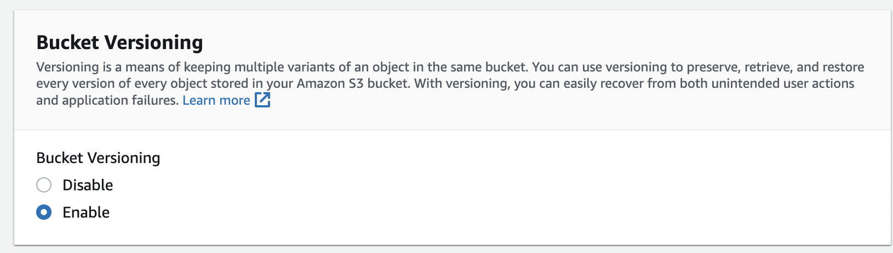

# Install

[AWS CLI](https://docs.aws.amazon.com/cli/latest/userguide/getting-started-install.html)

[Terraform](https://developer.hashicorp.com/terraform/downloads)

# Credentials

```
// ~/.aws/credentials
[cloudcasts]
aws_access_key_id = ...
aws_secret_access_key = ...
```

# Command

```sh
terraform fmt

terraform plan

terraform plan -out output.hcl

terraform plan -var-file variables.tfvars

terraform apply

terraform apply output.hcl // you don't get a prompt for `yes`

terraform apply -var-file variables.tfvars // with a variable file
```

# Create a bucket for terraform resources





# Create a dynamoDB for state locking and consistency


# AWS Provider

https://registry.terraform.io/providers/hashicorp/aws/latest/docs

# Terraform Language Documentation

https://developer.hashicorp.com/terraform/language

# ACL / Policy Difference

https://binaryguy.tech/aws/s3/iam-policies-vs-s3-policies-vs-s3-bucket-acls
